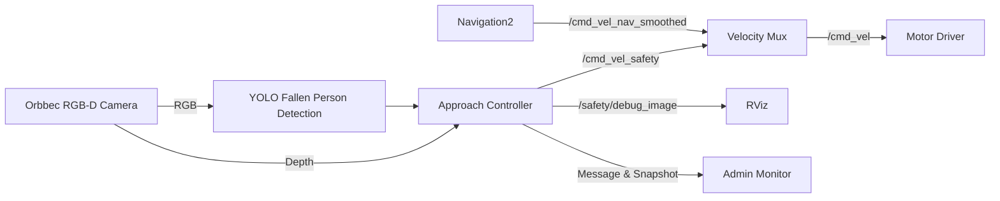

# YOLO 기반 쓰러진 작업자 감지·접근 로봇

2026 광운대학교 자율주행 로봇 전문가 과정 부트캠프

스토리지 로봇이 RGB-D 카메라로 주변을 감시하며 천천히 회전하고, YOLO 모델이 바닥에 누워 있는 사람을 감지하면 회전을 멈춘 뒤 해당 사람에게 접근한다. 도착 후에는 사고 사진과 메시지를 ROS2 토픽으로 관리자에게 전달한다.

## 주요 기능

- YOLOv8n 기반 `Fallen Person` 실시간 감지
- RViz에서 바운딩박스와 로봇 상태 표시
- 제자리 회전 탐색 및 감지 즉시 정지
- 바운딩박스 중심을 이용한 방향 정렬
- RGB-D 깊이 정보를 이용한 거리 측정 및 접근
- 약 0.5m 앞에서 정지
- 사고 사진 저장 및 관리자 메시지 전송
- 노트북 터미널 경고음 출력

## 동작 흐름

```text
SEARCH → DETECTED → APPROACH → ARRIVED
```

1. `SEARCH`: 로봇이 천천히 회전하며 주변을 감시한다.
2. `DETECTED`: 쓰러진 사람을 감지하면 즉시 정지한다.
3. `APPROACH`: 사람을 화면 중앙에 맞추며 접근한다.
4. `ARRIVED`: 목표 거리에서 정지하고 사진·메시지·경고음을 전송한다.

## 시스템 구조



## YOLO 모델

Roboflow의 People Falls Dataset v1과 직접 촬영한 이미지를 사용해 `YOLOv8n`을 학습했다.

| 항목 | 결과 |
|---|---:|
| 클래스 | `Fallen Person` |
| Precision | `0.98657` |
| Recall | `0.95371` |
| mAP50 | `0.97234` |
| mAP50-95 | `0.92417` |

학습 코드와 모델은 다음 위치에 있다.

```text
Autonomous_Robot_Yolo_train.ipynb
yolo_눕방_detection/models/best.pt
ros2_ws/best.pt
```

## 프로젝트 구조

```text
.
├── Autonomous_Robot_Yolo_train.ipynb
├── requirements.txt
├── yolo_눕방_detection/
│   ├── models/best.pt
│   └── scripts/realtime_detection_webcam.py
└── ros2_ws/
    ├── best.pt
    └── src/
        ├── fallen_person_safety/
        ├── storagy/
        ├── motor_driver2/
        └── aruco_moving1/
```

## 실행 환경

- Ubuntu 22.04
- ROS2 Humble
- Python 3.10
- Ultralytics YOLO
- OpenCV
- Orbbec RGB-D Camera
- Navigation2 / RViz2

Navigation2와 OrbbecSDK ROS2 패키지는 로봇 PC에 별도로 설치되어 있어야 한다.

## 빌드

```bash
cd ros2_ws
source /opt/ros/humble/setup.bash
python3 -m venv --system-site-packages .venv
source .venv/bin/activate
pip install ultralytics opencv-python
python -m colcon build --symlink-install
source install/setup.bash
```

## 실행

터미널 1 — 로봇, 카메라, 모터, RViz:

```bash
cd ros2_ws
source /opt/ros/humble/setup.bash
source install/setup.bash
ros2 launch storagy bringup.launch.py
```

터미널 2 — YOLO 감지 및 접근 제어:

```bash
cd ros2_ws
source /opt/ros/humble/setup.bash
source .venv/bin/activate
source install/setup.bash
ros2 launch fallen_person_safety fallen_person_safety.launch.py
```

RViz에서는 `/safety/debug_image` 토픽을 통해 YOLO 결과를 확인할 수 있다.

## 주요 ROS2 토픽

| 토픽 | 역할 |
|---|---|
| `/camera/color/image_raw` | RGB 카메라 영상 |
| `/camera/depth/image_raw` | 깊이 영상 |
| `/safety/debug_image` | YOLO 바운딩박스 영상 |
| `/cmd_vel_safety` | 사람 접근 속도 명령 |
| `/cmd_vel` | 모터 드라이버 최종 명령 |
| `/safety/incident` | 관리자 사고 메시지 |
| `/safety/snapshot/compressed` | 사고 현장 사진 |

캡처 이미지는 `~/fallen_person_incidents`와 `~/fallen_person_admin_received`에 저장된다.
